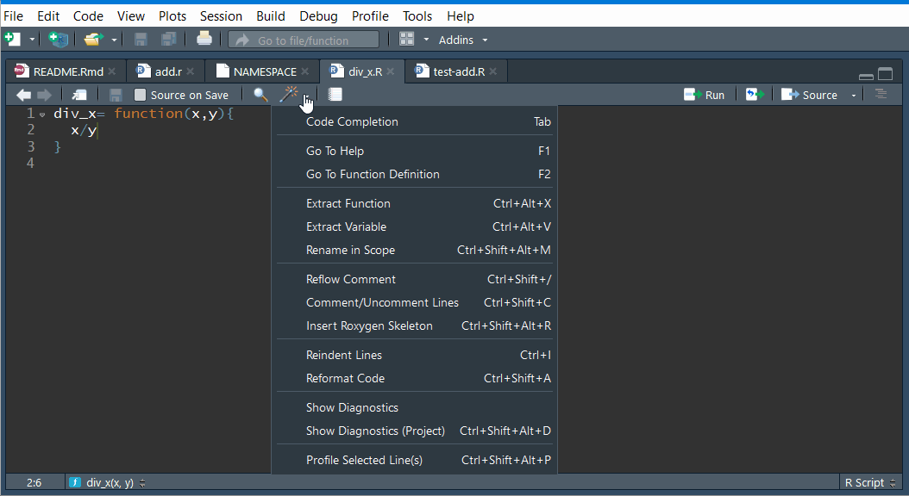
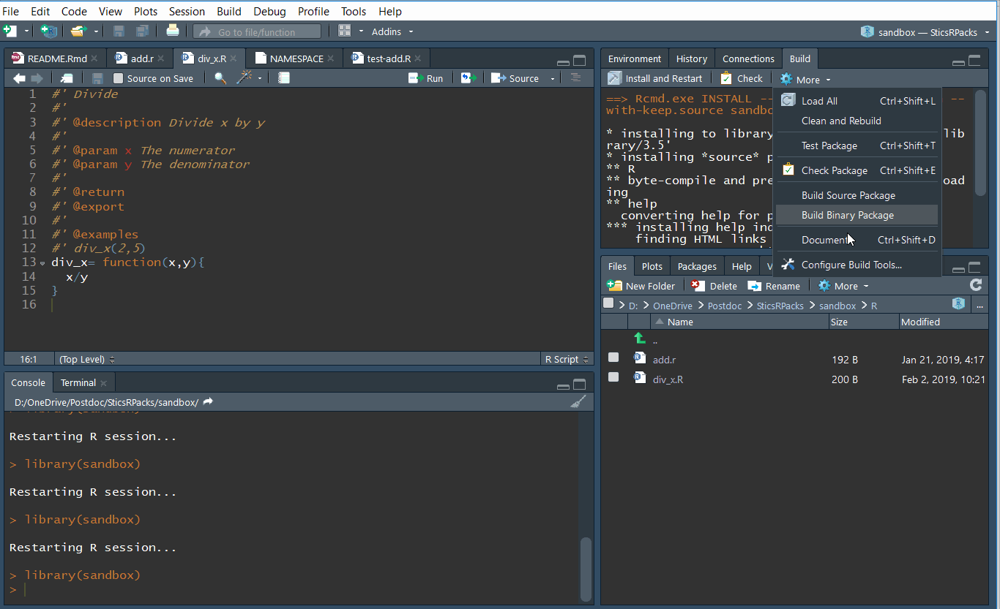
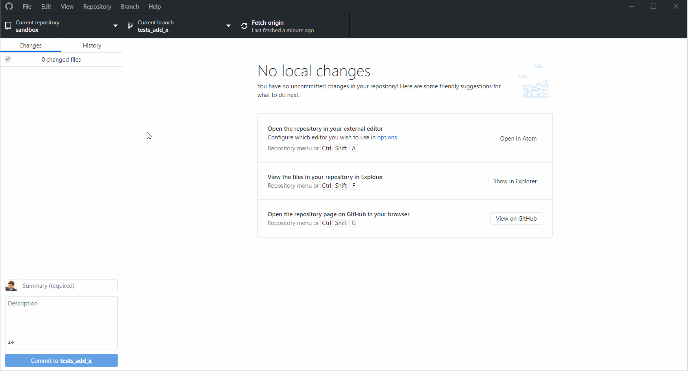
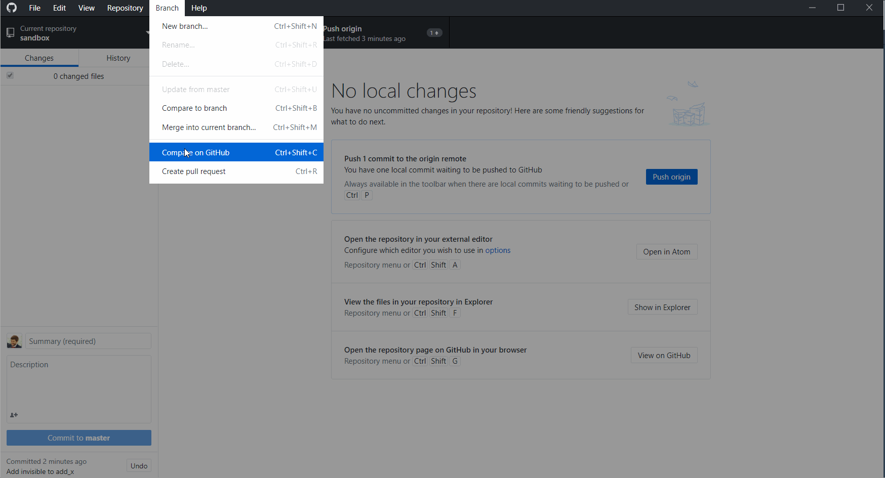

<!-- rmarkdown v2 -->

<!-- README.md is generated from README.Rmd. Please edit that file -->

# sandbox

[](https://ci.appveyor.com/project/SticsRPacks/sandbox)
[](https://travis-ci.org/SticsRPacks/sandbox)
[](https://codecov.io/github/SticsRPacks/sandbox?branch=master)
[](https://www.repostatus.org/#active)
<!-- [](https://www.gnu.org/licenses/gpl-3.0) -->

## Welcome \!

If you are a newcomer in the `SticsRPacks` community, this repository is
for you. It was specifically created to help new people to learn the
basis of all tools used in the project.

The first thing to learn in this tutorial is how to use GIT and GITHUB.

## GIT and GITHUB

GIT is a software designed for efficient version control. It helps you
and your collaborators develop better softwares. With GIT, you can save
“snapshots” of your work at any moment, and return to a previous state
whenever you want. GIT has much more to offer, but this is out of the
scope of this introduction.

### GIT basis

You’ll need some basis on GIT before training on this repository. A
first reading that is well adapted to our example is [the book of Hadley
Wickham](http://r-pkgs.had.co.nz/git.html). It explains well the basis
of GIT in conjunction with R. There are also several tutorials on the
internet for begginers:

  - [learngitbranching](https://learngitbranching.js.org/)
  - [Git Gud, web based
    simulator](https://nic-hartley.github.io/git-gud)
  - [Udacity free
    MOOC](https://eu.udacity.com/course/how-to-use-git-and-github--ud775#?autoenroll=true)
  - [Github tutorial](https://lab.github.com/)
  - [openclassrooms
    course](https://openclassrooms.com/fr/courses/2342361-gerez-votre-code-avec-git-et-github)
    (in french only).

A good way to start is also to read the [GIT
book](https://git-scm.com/book/en/v2), that is made for everybody from
beginners to advanced users.

### Clone the sandbox repo

The next step after learning GIT is to use this example. To do so,
follow these simple steps:

1.  Download [GIT](https://git-scm.com/) and install it.  
2.  Download and install [Github desktop](https://desktop.github.com/),
    for Windows or Mac, an app that will help you use GIT. For linux,
    you can install for example
    [GitAhead](https://gitahead.github.io/gitahead.com).
3.  Create an account on [Github](https://github.com/).
4.  Open Github desktop, and set your personal informations to connect
    to your `Github.com` account.
5.  On Github desktop, go to `File`, clone repository, or press
    `ctrl+shift+O`. And then click on `URL`, and enter this address:

<!-- end list -->

``` html
https://github.com/SticsRPacks/sandbox.git
```

Then, choose where the repository will be cloned (copied) into your
computer.

> People that already are members of the SticsRPacks organisation may
> find the repository directly in the “Github.com” tab.

Congratulations, you just cloned the sandbox repository onto you
computer\! Now you can see all files in your computer by opening the
corresponding folder (`ctrl+shift+F`).

## R package format

An R package needs several mandatory files and folders:

  - `DESCRIPTION`: this file describes the package (name, authors…)
  - `NAMESPACE`: this file lists the functions
  - `R` folder: the folder that contains all R code
  - `man` folder: the folder that contains all the help pages of the
    package
  - `.Rbuildignore`: the file that tells R which files are excluded from
    the package build

And some are not mandatory but helpful:

  - `LICENSE`: the license under which the project is developed on.
  - `README.Rmd`: A text file that explains the project to humans using
    the Rmarkdown format. When knited, this file produces the
    `README.md` file that is rendered by Github on the main page. This
    very page is a `README.md` page that is rendered by Github, and that
    was created using a `README.Rmd` file.
  - `README.md`: the file rendered by Github in the main page of the
    repository and that aims at explaining the project objectives.
  - `.gitignore`: the file that tells GIT which files to ignore.

Most of these files are automatically generated using specific tools
that are described further.

## Package example

Before doing this tutorial, you need to:

1.  Download and install [RStudio](https://www.rstudio.com/)
2.  Download and install [R](https://cloud.r-project.org/)
3.  Download and install the tools to build the package:
      - [Rtools](https://cran.r-project.org/bin/windows/Rtools/) if you
        have a windows machine
      - `XCode` from the AppStore if you have a mac
      - `r-base-dev` on linux
4.  Use this command line on R to download these
packages:

<!-- end list -->

``` r
install.packages(c("devtools", "roxygen2", "testthat", "knitr","usethis"))
```

### Open the Rstudio project

Double-click on the `sandbox.Rproj` file. It will open the Rstudio
project. The `.Rproj` file contains informations about the project for
RStudio (*e.g.* it is an R package, it uses devtools, etc…).


From the `Files` window, open the R folder. You will find here all the R
scripts used for the package.

### Simple function

It is highly encouraged to put each function in a separate file, unless
they are very short and can be grouped under a common file with a title
that describes well their purpose.

Click on the [`add.r`](R/add.r) file. This file contains one function:
`add_x()`. This function simply adds the input to itself. You can see
that it is preceded by some text formatted as follows: `#' Text`. This
text is a Roxygen documentation. It is formated on a special way that
helps R generate the package documentation.

### Documentation

The help pages of each function in a R package are generated by
`roxygen2`. To learn more about function documentation read [this
vignette](https://cran.r-project.org/web/packages/roxygen2/vignettes/roxygen2.html),
and to learn more about the format of the documentation read [this
vignette](https://cran.r-project.org/web/packages/roxygen2/vignettes/rd.html)
and [this
one](https://cran.r-project.org/web/packages/roxygen2/vignettes/formatting.html).

Markdown can be used optionally in Roxygen documentation. To use it,
execute the following line once:

``` r
# install.packages("roxygen2md")
usethis::use_roxygen_md()
```

### Build the package

Now that you have the package on your computer, you can build the
documentation for all your functions by pressing `ctrl+shift+D`, or by
going on the `Build` tab on the upper-right and by clicking on
`More`\>`Document`. This uses Roxygen to build the help pages from the
documentation you write above your functions. The help pages are written
in `.Rd` files on the `man` folder of the package. Do not edit these
files manually.

You can finally build and install your package by going on the `Build`
tab on the upper-right, and by clicking on the `Install and Restart`
button (or press `ctrl+shift+B`). This step build the package into your
computer.

Now execute this command to access the help page of the function:

``` r
?add_x
```

The help page of the function should pop-up.

### Add a function

Create a new R script file, add the following code and save it:

``` r
div_x= function(x,y){
  x/y
}
```


This function divides x by y and return the result.

To add some documentation to your function, place your cursor into the
function, click on the magic wand just above your script and choose
`Insert Roxygen Skeleton`, or press `ctrl+shift+alt+R`. This will create
a dummy Roxygen documentation above your function using the arguments of
your function.



Your function should look like this now:

``` r
#' Title
#'
#' @param x 
#' @param y 
#'
#' @return
#' @export
#'
#' @examples
div_x= function(x,y){
  x/y
}
```

Fill the documentation, and add some new keywords such as a description:

``` r
#' Divide
#'
#' @description Divide x by y
#'
#' @param x The numerator
#' @param y The denominator
#'
#' @return x/y
#' @export
#'
#' @examples
#' div_x(1,2)
div_x= function(x,y){
  x/y
}
```

Then re-build your documentation (`ctrl+shift+D`), and re-build your
package (`ctrl+shift+B`).



You should have access to your own function help page:

``` r
?div_x
```

## Test your functions

After writing a new function or modifying one, it is important to test
it. This step is mandatory, because some other functions may call this
very function you just wrote, and it becomes more and more difficult to
know where bugs are located when none of the functions were thoroughly
tested. There are two steps to test a function. The first one is to test
it by yourself when designing it, and the other one is by adding
automatic tests.

### Manually

When coding a function, you should always test if each line of code in
your function is returning the expected result, and if the function
returns the correct output after execution.  
It is good practice to maintain your R package as light as possible by
keeping the data outside of it whenever possible. Creating an
independent R project for tests helps you to keep the external data or
executables and the created outputs outside of the package project. To
do so, you can create a separate Rstudio project where you will test
your package: go to `File`\>`New Project`\>`New Directory`\>`New
Project`, type your project name and choose where it will be located on
your computer. The project name is usually taken as the R package name
followed by “test”, such as `SticsOnR_test`. This step is not mandatory
but strongly advised.

After creating the new project, add a new R script (`ctrl+shift+N`),
load your R package such as:

``` r
library(SticsOnR)
```

And test your function by giving different inputs and checking the
function outputs.

### Automatically

Manual tests are a good first step to evaluate a function, but
developers tend to test their functions once only, and to skip the tests
when making a small change. This methodology can make the code break for
everybody when something is changed but not tested, which is not
desirable.

To avoid these difficulties, it is strongly advised to use automatic
tests, also called unit tests. These tests are written once, and
executed each time the code of the package is pushed to `github.com`, or
every time the developer needs to. These tests are implemented by using
the `testthat` package. All documentation is available on the [package
website](https://testthat.r-lib.org/).

To add unit tests to our example function (or to a set of functions),
run this command:

``` r
usethis::use_test("div_x")
```


If you add tests on your package for the first time, the
`usethis::use_test()` command will create all the infrastructure you
need, if not, it will just create a new test script to your tests.

Now a new folder appeared in our project: `tests`, which contains two
things:

  - A subfolder called `testthat` that contains all tests scripts you
    created.

  - An R script called `testthat.R`. This script will call all tests in
    the R scripts located in `testthat`. Do not mind this script, you
    will probably never have to modify it.

If you executed the previous command, you should have a unit test script
called `test-add.R` in this directory with the following code:

``` r
context("test-add")

test_that("multiplication works", {
  expect_equal(2 * 2, 4)
})
```

This test is an example that tests if `2 * 2` is equal to `4`. Change
the code to the following to test our function:

``` r
context("test-add")

test_that("add_x returns right output", {
  expect_equal(div_x(1,2), 0.5)
})
```

This code tests that `div_x(1,2)` returns `0.5`. To run the test, go to
the `Build` tab, and choose `Test Package`, or press `ctrl+shift+T`. The
tests will all be executed, and a report will appear on the `Build` tab
at the end, showing which tests were successfull, and which failed or
returned warnings.


You should add different tests for each of your functions, to check if
they work correctly, and if they handle errors properly.

More details about unit tests with `testthat` are given
[here](http://r-pkgs.had.co.nz/tests.html).

### CRAN tests

The `devtools` package that you installed previously adds also the tests
that CRAN do on all packages. These tests consists on checking that all
mandatory files are present, that functions are well documented, etc… It
is very important to check the package regularly for errors so the users
can download a functionning package. To start a CRAN check, go to the
`Build` tab, press the `More` button, and choose `Check Package`, or
simply use `ctrl+shift+E`. The package will be checked, and a report
will be given at the end.


## Make a website

A website can be automatically generated from the helpfiles of the R
package, the vignettes and the `README.md` file by using the `pkgdown`
package. For example the auto-generated website for the `SticsOnR`
package is available [here](https://sticsrpacks.github.io/SticsOnR/).

To set up the website, simply execute the following code each time you
update the package:

``` r
pkgdown::build_site()
```


When first called, the function creates a new folder called `docs` where
it puts all the `html` files for the website. When pushed to github.com,
a website is created from these files if you authorized github pages.

To authorize github pages, go to the project page on the repository,
then go to `settings`\>`Github Pages`\>`Source` and then choose `master
branch /docs folder`.

The website will be at an address of the form
([https://sticsrpacks.github.io/{packagename}/](https://sticsrpacks.github.io/%7Bpackagename%7D/)),
for example our project is rendered at this adress:
<https://sticsrpacks.github.io/sandbox/>

## Share your changes using GIT/GITHUB

### Branches

For the sake of simplicity, we only used the `master` branch of the
repository in the previous example. The downside of using only this
branch is that each time a user will change the code while you change it
also, it will override the others code. To avoid this behavior, GIT has
a nice feature called branches. A branch can be thought as a copy of
your project at a given time, that have a parallel history to the
`master` branch. In other words, it allows you to develop some code
while not bothering the others.

To ensure that developers use branches, all the `master` branches of the
SticsRPacks repositories will be protected against commits, and must
have at least one reviewer. See [this
page](https://help.github.com/en/articles/configuring-protected-branches)
for more details on how to set those rules.

To make modifications to the code, you can create your own branch using
Github desktop. Usually, we name a branch after the feature it is
supposed to add. You can make a new branch for each independent feature
you want to use. To create a new branch, simply follow the steps showed
below:


### Make your changes

You can then freely work on your code without making any changes to the
master branch. For instance, we can add some tests inside the `add_x`
function to test if the input `x` is numeric before computing the
addition:


### Commit

Each time you modify the package, you should commit your changes to GIT.
It is good practice to commit whenever a little step has been reached so
the commit message is short enough but still explains everything you
did. This methodology make more commits, but is still preferred because
it is easier to find changes in the history earlier. So do not hesitates
to split your work into little commits.

To commit your changes, open `Github desktop` and choose the repository.
The files that were modified in the repository appear in the left-most
window, and the associated code that was added or removed should appear
in the window on the right. The code in green was added, and the code in
red was removed. To commit those changes, enter a commit message in the
left window next to your account image, where it is written `Summary
(required)`. The message should be concise but should describe all the
changes. Then press `Commit to master`. Your changes are commited to the
master branch and saved on your computer.


### Push

Whenever your work is done, or you go for lunch, you should push all
your commits to github.com. To do so, just press the `Push origin`
button in the center or in the upper window. Github desktop will send
the changes to github.com, and they should appear in the repository.

If you just created your branch, you have to publish it Github.com
before:


### Pull request

Whenever you finished the modifications you wanted to do with your
branch, you can make a pull request. This is a way of asking other
contributors for their approval of your changes before merging your code
to the `master` branch:



You’ll have several steps to complete after:

  - give a general title to your pull request, for example here it is
    named after the last commit: “Test if x is numeric in add\_x”  
  - add a little description of the changes
  - check if the merge is automatic or not (is there any conflicts ?)
  - wait for the automatic tests to run, and if they are successfull:
  - assign a reviewer if possible


  - and finally create the pull request.

### Review

As a reviewer, you’ll have to open the pull request (in the Pull
requests tab), and review the code in the “Files changed” sub-tab:


If there are some changes needed before merging the code to the `master`
branch, you can leave a comment (and even propose some code) right where
the changes are needed.

Then, the person that did pull the request will have to integrate those
proposed changes into its own branch, commit the changes, and update the
pull request.

Then, the reviewer will review the code again, and can finally accept
the pull request: 
When the pull request is accepted, it can finally be merged into the
`master` branch:


This step will add all the commits from the branch to the `master`
branch. A cleaner option is to use the `Squash and merge` option, which
will combine all commits from the branch into one commit only. This
option may be cleaner to avoid too many unnecessary commits in the
master branch.  
You can optionally delete the branch after merging it to make a cleaner
repository.

Note that the previous step can be made all at once by the reviewer
(accept and merge).

### Update

Once the merge is done, all users can update their local repository with
the new code. If the branch was deleted from Github.com, it will still
remain on the local copy of the user, so you will have to delete it
manually using Github desktop:


### Conflicts

A pull request may modify some code that was also modified by another
user that pulled his changes before you in the `master` branch. In that
case, GIT cannot know which code is the right one, or if there is a need
of more code to integrate both changes, so a manual choice has to be
made.

Here is an example of a conflict in two steps:

  - Making different modifications on two different branched: 

  - Trying to merge the branches and resolving the conflicts using Atom:



This is an example made on the local repository, but a pull request
would yield the same result.

Here is an example with a pull request from a branch:


As you can see, this pull request cannot be automatically merged, so you
have to resolve the conflicts from your computer, or you can even use
the web editor if you prefer:


## Install

New users can now install your package directly from the Github
repository using this command line:

``` r
# install.packages("remotes")
remotes::install_github("SticsRPacks/sandbox")
# Or using devtools if already installed:
devtools::install_github("SticsRPacks/sandbox")
```


## Badges, CI and code coverage

### Badges

Badges, or shields allows a quick look to the status of a repository at
a given moment. For example there is a badge that shows which licence
the repository uses. This badge can be found on
[shields.io](https://shields.io/#/examples/license), and more are
available from the [main page](https://shields.io) of this website or
from other websites. For example, the project status is an interesting
information for new users: [](https://www.repostatus.org/#active).

The badges are often integrated in the head of the README file so users
can see the repository status directly.

### CI

There are some interesting external tools that can be used to enhance
collaboration. For example the package CRAN checks and unit tests can be
run online each time a push has been done to github.com. This is called
continuous integration, or CI. [Travis CI](https://travis-ci.org/) and
[AppVeyor](https://ci.appveyor.com) are two well-known tools for CI. The
first one is used to test the package on linux, and the second one on
windows. To set up automatic tests online, you need to link the package
to these services, and to add configuration files for each one. You can
do so only if you have the required rights on the project.

First, add the configuration files to the repository:

``` r
usethis::use_travis()
usethis::use_appveyor()
```

The first command creates a `.travis.yml` file in the project root, and
the second one the `appveyor.yml`. These files are configuration files
for each service. Each command execution gives you a link that you can
copy and paste in your `README.md` file such as on this README. This
link will add a badge that indicates the status of the build on each
service. For example here is the badge for TRAVIS-CI: [](https://travis-ci.org/SticsRPacks/sandbox).

If you have the rights, then you can go to the services to set up the CI
as described below.

#### Travis-CI

Go to [Travis CI](https://travis-ci.org/), sign in with your github
account, go to your repositories
[here](https://travis-ci.org/account/repositories), choose the
`SticsRPacks` organization, and activate the repository.

#### AppVeyor

Go to [AppVeyor](https://ci.appveyor.com), sign in with your github
account, and choose the repository
[here](https://ci.appveyor.com/projects/new).

### Code coverage

The code coverage is a statistic that express how many functions are
tested in a project. This is very useful to control the code quality of
a repository at a glance. To set up code coverage, you can use the
service from [codecov.io](https://codecov.io/), and set it up like the
CIs.

First, install the `covr` package:

``` r
install.packages("covr")
```

And then set the configuration file:

``` r
usethis::use_coverage()
```

And then, you’ll have to add a line of code on the Travis-CI
configuration file to make Travis-CI build the report of coverage.
Please modify your `.travis.yml` file such
as:

``` yaml
# R for travis: see documentation at https://docs.travis-ci.com/user/languages/r

language: R
sudo: false
cache: packages
r_github_packages:
  - r-lib/covr
after_success:
  - Rscript -e 'covr::codecov()'
```

You can add the badge to your README, such as: [](https://codecov.io/github/SticsRPacks/sandbox?branch=master).

Finally, go to [codecov.io](https://codecov.io/), log in with your
github account, and activate the repository.

## Licence

To use a licence, the easier way is to use the dedicated functions from
`usethis`. There are four licences available from this package: MIT,
GPL3, APL2 and CC0. [This website](https://choosealicense.com/licenses/)
can help you choose your licence according to your needs.

To set the licence to GPL v3, simply execute this line of code:

``` r
usethis::use_gpl3_license(name = "STICS Group")
```

It will create the licence file, add it to the `DESCRIPTION` file of
your package, and add it to `.Rbuildignore`.

## Summary

In summary, after everything is set up, here is the steps to follow:

1.  Modify the code or add new functions  
2.  Update the documentation (`ctrl+shift+D`)  
3.  Update the website (`pkgdown::build_site()`)
4.  Build the package (`ctrl+shift+B`)  
5.  (optional) Run the CRAN checks locally (`ctrl+shift+E`)  
6.  (optional) Run the unit tests locally (`ctrl+shift+T`)  
7.  Commit your changes using Github desktop  
8.  Push your commits to github.com  
9.  Control the badges to check that the package builds correctly on
    AppVeyor and Travis-CI
