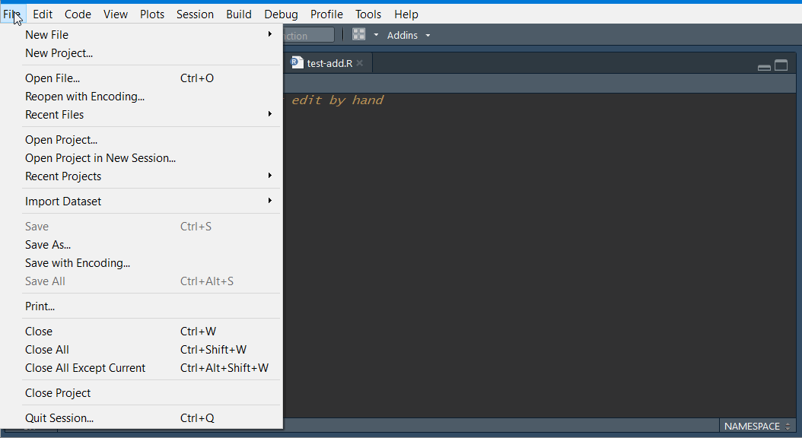
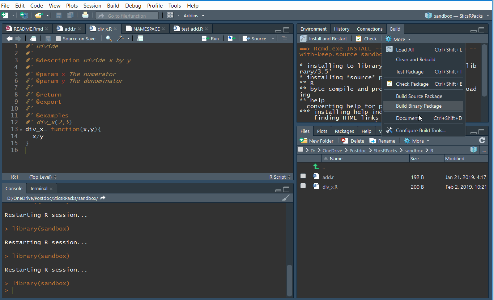
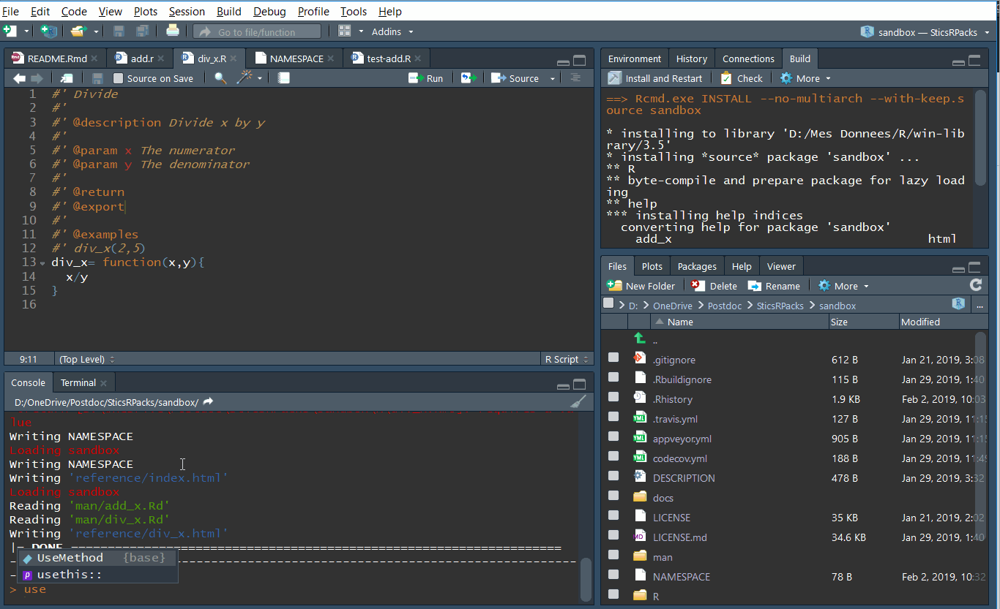
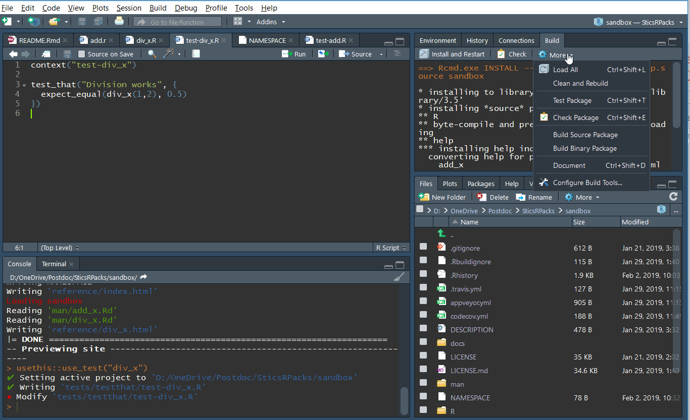
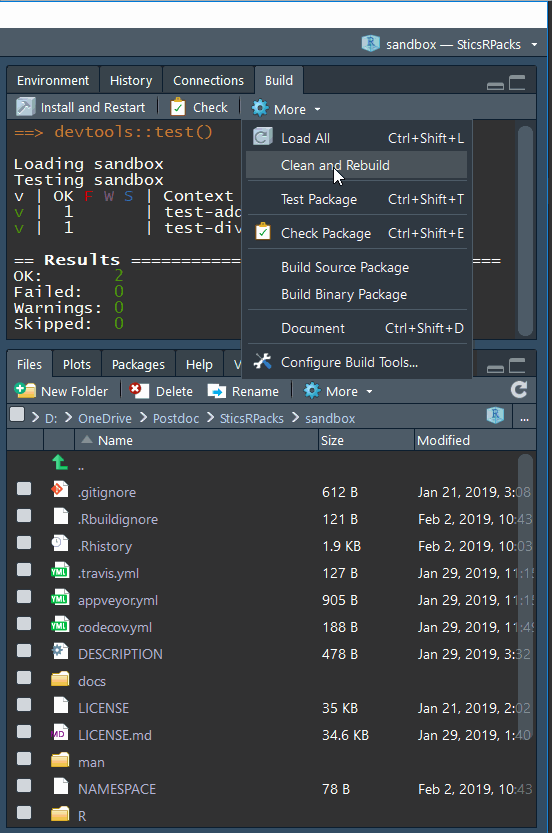
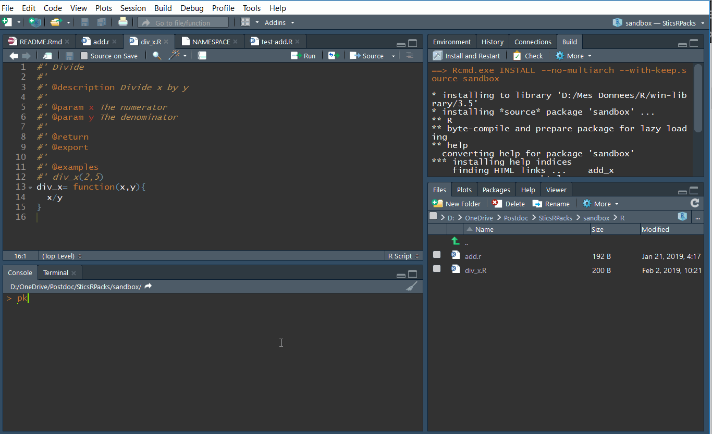

```{r setup, include = FALSE}
knitr::opts_chunk$set(
  collapse = TRUE,
  comment = "#>"
)
```


## Introduction

This tutorial was set up to learn as quickly as possible the basis of R packages development. It is not fully comprehensive, but rather points to specific state-of-the-art tools.

Some tools must be installed before starting this tutorial:

*	GIT : https://git-scm.com/
*	Github desktop (Windows and Mac : https://desktop.github.com/, Linux: https://github.com/shiftkey/desktop/releases) 
*	R: https://cloud.r-project.org/ 
*	Rstudio: https://www.rstudio.com/
*	Tools to build R packages: 
    +	Rtools for Windows users: https://cran.r-project.org/bin/windows/Rtools/
    +	XCode for Mac users (depuis l’AppStore)
    +	r-base-dev for linux users

Some R packages are also mandatory, and they must be up-to-date:
```{r, eval=FALSE}
install.packages(c("devtools", "roxygen2", "testthat", "knitr","usethis","pkgdown"))
```

## R package format

An R package needs several mandatory files and folders:

+ `DESCRIPTION`: this file describes the package (name, authors...)
+ `NAMESPACE`: this file lists the functions
+ `R` folder: the folder that contains all R code
+ `man` folder: the folder that contains all the help pages of the package
+ `.Rbuildignore`: the file that tells R which files are excluded from the package build

And some are not mandatory but helpful:

+ `LICENSE`: the license under which the project is developed on.
+ `README.Rmd`: A text file that explains the project to humans using the Rmarkdown format. When knited, this file produces the `README.md` file that is rendered by Github on the main page. This very page is a `README.md` page that is rendered by Github, and that was created using a `README.Rmd` file.
+ `README.md`: the file rendered by Github in the main page of the repository and that aims at explaining the project objectives.
+ `.gitignore`: the file that tells GIT which files to ignore.

Most of these files are automatically generated using specific tools that are described further.

## Creating an R package from sratch

To create the skeleton of a new package, we can use the `usethis` package:
```{r, eval=FALSE}
usethis::create_package(path = "tutorialPackage")
```

The function creates an R package with all mandatory files, and open the project in a new RStudio window. To re-open it next time, just double-click on the `tutorialPackage.RProj` file.

### DESCRIPTION file + LICENCE

A first step is to fill the `DESCRIPTION` file. Open it and adapt it to your use. Then, choose a licence to use for your project. If you don't know which one to use, [choosealicense](https://choosealicense.com/) can help you. 
In general, it is good practice to have a LICENSE file that describes it. To do so, use the commands from `usethis`. For example to set the LICENSE to GPL-3, execute this command:

```{r, eval=FALSE}
usethis::use_gpl3_license(name = "your name goes here")
```

### Add a README

The README file is the first file that is read by the users. You should always make one, and present your package here. This README file can be written in Rmarkdown so you can add some R code and some plots.

To do so, use `usethis::use_readme_rmd()`:

```{r, eval=FALSE}
usethis::use_readme_rmd()
```

This function will create a pre-formatted README.Rmd file. Try to update it a little bit, and then knit it to make the README.md file.

Rmarkdown is a document written in markdown that can integrate some R code. The R code can be displayed to the users, executed, and its output displayed if necessary. In fact this very document is written in Rmarkdown. 

If you don't know how to write a Rmarkdown file, there is a nice [cheat sheet by RStudio](https://www.rstudio.com/wp-content/uploads/2015/02/rmarkdown-cheatsheet.pdf). In few words, here are some basics synthax used in markdown:

* Headings are written using `#`. The title of rank 1 is written as: `# The big title`, the second rank is written as `## Rank two title`, the third one `### Little title`.

* Links are written as `[word that appear as text](www.the_actual_link.com)`

* Images are included by a link to their location
    * on the web: ``  
    * on your computer: ``
    
* Bold is written using two `**` as this: `**here is a bold sentence**`

* Italic is using one `*`: `here is a sentence in italic`

A markdown cheat sheet is available [here](https://github.com/adam-p/markdown-here/wiki/Markdown-Cheatsheet#links).


### Add a NEWS file

A news file is used to track the changes from one version of a package to another. It can be very usefull for users when there are breaking changes (*i.e.* code that potentially give errors when applied as in a previous version of the package).

### Add some code

Now we can add some code to the project. To do so, use this command:

```{r, eval=FALSE}
usethis::use_r(name = "div_x")
```

This function just creates an R script called "div_x". You can do it manually also if you prefer:



Each function should be in its own separate file. If some functions are highly related, you can group them into the same file though.

Open `div_x.R`, and add some code, for example this:

```{r, eval=FALSE}
div_x= function(x,y){
  x/y
}
```

This is a simple function that divides x by y.

### Document

It is **mandatory** to add documentation to all functions you create in a package. Fortunately, there is a tool for that too. This tool is called Roxygen2, and uses special formatted code to build documentation. 

To add some documentation to your function, place your cursor into the function, click on the magic wand just above your script and choose Insert Roxygen Skeleton, or press ctrl+shift+alt+R. This will create a dummy Roxygen documentation above your function using the arguments of your function.


Your function should look like this now:

```{r eval=FALSE}
#' Title
#'
#' @param x 
#' @param y 
#'
#' @return
#' @export
#'
#' @examples
div_x= function(x,y){
  x/y
}
```

Fill the documentation, and add some new keywords such as a description: 
```{r eval=FALSE}
#' Divide
#'
#' @description Divide x by y
#'
#' @param x The numerator
#' @param y The denominator
#'
#' @return x/y
#' @export
#'
#' @examples
#' div_x(1,2)
div_x= function(x,y){
  x/y
}
```


Then re-build your documentation (`ctrl+shift+D`), and re-build your package (`ctrl+shift+B`). 



You should have access to your own function help page:
```{r, eval= FALSE}
?div_x
```

## Test your functions

After writing a new function or modifying one, it is important to test it. This step is mandatory, because some other functions may call this very function you just wrote, and it becomes more and more difficult to know where bugs are located when none of the functions were thoroughly tested. There are two steps to test a function. The first one is to test it by yourself when designing it, and the other one is by adding automatic tests.

### Manually

When coding a function, you should always test if each line of code in your function is returning the expected result, and if the function returns the correct output after execution.  
It is good practice to maintain your R package as light as possible by keeping the data outside of it whenever possible. Creating an independent R project for tests helps you to keep the external data or executables and the created outputs outside of the package project. To do so, you can create a separate Rstudio project where you will test your package: go to `File`>`New Project`>`New Directory`>`New Project`, type your project name and choose where it will be located on your computer. The project name is usually taken as the R package name followed by "test", such as `SticsOnR_test`. This step is not mandatory but strongly advised.  

After creating the new project, add a new R script (`ctrl+shift+N`), load your R package such as: 

```{r eval=FALSE}
library(SticsOnR)
```

And test your function by giving different inputs and checking the function outputs.  


### Automatically

Manual tests are a good first step to evaluate a function, but developers tend to test their functions once only, and to skip the tests when making a small change. This methodology can make the code break for everybody when something is changed but not tested, which is not desirable.

To avoid these difficulties, it is strongly advised to use automatic tests, also called unit tests. These tests are written once, and executed each time the code of the package is pushed to `github.com`, or every time the developer needs to. These tests are implemented by using the `testthat` package. All documentation is available on the [package website](https://testthat.r-lib.org/).

To add unit tests to our example function (or to a set of functions), run this command:  
```{r, eval=FALSE}
usethis::use_test("div_x")
```



If you add tests on your package for the first time, the `usethis::use_test()` command will create all the infrastructure you need, if not, it will just create a new test script to your tests. 

Now a new folder appeared in our project: `tests`, which contains two things:

* A subfolder called `testthat` that contains all tests scripts you created.

* An R script called `testthat.R`. This script will call all tests in the R scripts located in `testthat`. Do not mind this script, you will probably never have to modify it. 

If you executed the previous command, you should have a unit test script called `test-add.R` in this directory with the following code:

```{r, eval=FALSE}
context("test-add")

test_that("multiplication works", {
  expect_equal(2 * 2, 4)
})
```

This test is an example that tests if `2 * 2` is equal to `4`. Change the code to the following to test our function:

```{r, eval=FALSE}
context("test-add")

test_that("add_x returns right output", {
  expect_equal(div_x(1,2), 0.5)
})
```

This code tests that `div_x(1,2)` returns `0.5`. To run the test, go to the `Build` tab, and choose `Test Package`, or press `ctrl+shift+T`. The tests will all be executed, and a report will appear on the `Build` tab at the end, showing which tests were successfull, and which failed or returned warnings. 




You should add different tests for each of your functions, to check if they work correctly, and if they handle errors properly.

More details about unit tests with `testthat` are given [here](http://r-pkgs.had.co.nz/tests.html).


### CRAN tests

The `devtools` package that you installed previously adds also the tests that CRAN do on all packages. These tests consists on checking that all mandatory files are present, that functions are well documented, etc... 
It is very important to check the package regularly for errors so the users can download a functionning package. To start a CRAN check, go to the `Build` tab, press the `More` button, and choose `Check Package`, or simply use `ctrl+shift+E`. The package will be checked, and a report will be given at the end. 



## Make a website  

A website can be automatically generated from the helpfiles of the R package, the vignettes and the `README.md` file by using the `pkgdown` package. For example the auto-generated website for the `SticsOnR` package is available [here](https://sticsrpacks.github.io/SticsOnR/).

To set up the website, simply execute the following code each time you update the package:

```{r, eval=FALSE}
pkgdown::build_site()
```



When first called, the function creates a new folder called `docs` where it puts all the `html` files for the website. 

## Learn GIT + Github

Go to the [next vignette](GIT_and_GITHUB.html).
