```{r setup, include = FALSE}
knitr::opts_chunk$set(
  collapse = TRUE,
  comment = "#>"
)
```


## Personal GIT and GITHUB

### Introduction to GIT

GIT is a software designed for efficient version control. It helps you and your collaborators develop better softwares. With GIT, you can save “snapshots” of your work at any moment, and return to a previous state whenever you want. GIT has much more to offer, but this is out of the scope of this introduction.

A good way to learn the few main commands of GIT is by completing at leats the first 3 exercices from [learngitbranching](https://learngitbranching.js.org/). These few exercices will show you very quickly how to use these commands, and when to use them.

Further informations can be found in [the book of Hadley Wickham](http://r-pkgs.had.co.nz/git.html). It explains well the basis of GIT in conjunction with R. There are also several tutorials on the internet for begginers:

+ [learngitbranching](https://learngitbranching.js.org/) as stated before
+ [Git Gud, web based simulator](https://nic-hartley.github.io/git-gud)
+ [Udacity free MOOC](https://eu.udacity.com/course/how-to-use-git-and-github--ud775#?autoenroll=true)
+ [Github tutorial](https://lab.github.com/)
+ [openclassrooms course](https://openclassrooms.com/fr/courses/2342361-gerez-votre-code-avec-git-et-github) (in french only).

A good way to start is also to read the [GIT book](https://git-scm.com/book/en/v2), that is made for everybody from beginners to advanced users. It is especially usefull if you have an e-reader.


### Add GIT versionning to your package

To add GIT versionning to your package, use this command:

```{r, eval=FALSE}
usethis::use_git()
```

This function will initialize the versioning using GIT with a first commit, and set your .Rbuildignore and .gitignore files. Those are configuration files telling R and GIT to not use some files or folders in the project.

### Use GITHUB DESKTOP

Open GITHUB Desktop, enter your Github.com credentials, and do `ctrl+O` to add your R package.
Once done, try to add or modify some code. The new code appears in Github desktop as green if added, and red if deleted.
Now you can commit your changes to save them:

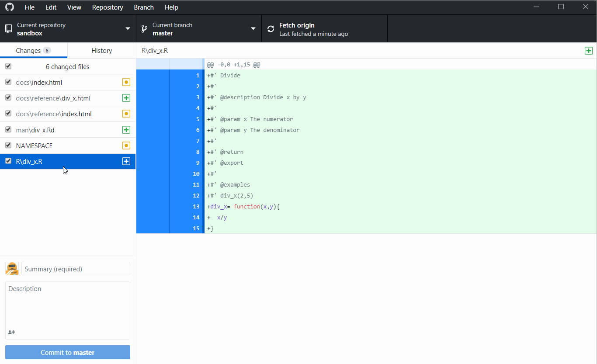

### Publish your GIT repo to GITHUB.com

A big benefit of using GIT is being able to have a copy of your code on a remote server. In GIT, a project containing code is called a repository. Now we can push (*i.e.* send) our local repository to Github.com by clicking on `Publish to Github.com`.  
Once done, you will be able to see this repository on your personal account in Github.com.

Go to your Github.com account, and find your repository. You now see why the README file is important. It is rendered automatically by Github.com as a welcome page, so it is the showcase of your project for your future collaborators and users.

### Publish the package website

When pushed to github.com, a website is created from the files located in the `docs` folder, provided that you authorized github pages to make the website.  
To authorize github pages, go to the project page on the repository, then go to `settings`>`Github Pages`>`Source` and then choose `master branch /docs folder`.

The website will be at an address of the form (https://{your user name}.github.io/{packagename}/), for example the sandbox project is rendered at this adress: https://sticsrpacks.github.io/sandbox/


## Shared GITHUB projects

The greatest benefit of GIT + Github is to ease the team collaboration on a given project. There are many tools provided by Github.com that we can use. Here is a little introduction to them.

### Clone

To collaborate on a project, you first have to import it on your computer. To do so, there are two ways: to clone the repository, or to fork it. We will only talk about cloning during this tutorial, but forking is also a very interesting way for bigger projects.

To clone the `sandbox` project, simply go to Github desktop, go to `File`, clone repository, or press `ctrl+shift+O`. And then click on `URL`, and enter this address:

```html
https://github.com/SticsRPacks/sandbox.git
```
Then, choose where the repository will be cloned (copied) into your computer.

>People that already are members of the SticsRPacks organisation may find the repository directly in the "Github.com" tab.

Congratulations, you just cloned the sandbox repository onto you computer!
Now you can see all files in your computer by opening the corresponding folder (`ctrl+shift+F`).


Now open the project in RStudio and explore the files.


### Use branches

For the sake of simplicity, we only used the `master` branch of your test package in the previous example. The downside of using only this branch is that each time a user will change the code while you change it also, it will override the others code. To avoid this behavior, GIT has a nice feature called branches. A branch can be thought as a copy of your project at a given time, that have a parallel history to the `master` branch. In other words, it allows you to develop some code while not bothering the others.

To ensure that developers use branches, all the `master` branches of the SticsRPacks repositories will be protected against commits, and must have at least one reviewer. See [this page](https://help.github.com/en/articles/configuring-protected-branches) for more details on how to set those rules.

To make modifications to the code, you **must** first create your own branch using Github desktop. It is strongly recommended to name the branch after the feature it is supposed to add. If several people work on the same feature, they have to create a branch for the feature that will be common for them, and after create their own branch that will feed this one.

You can also make a new branch for each independent feature you want to use, because branches are the core feature of GIT (*i.e.* they are optimized to not take too much disk space). To create a new branch, simply follow the steps showed below:

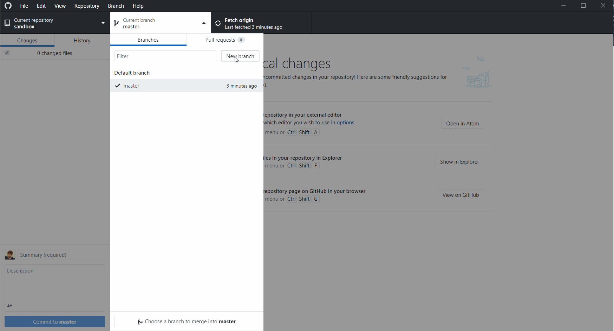

Make a new branch using Github desktop, use the name you want, and make sure your are working on this branch.


### Make your changes

You can then freely work on your code without making any changes to the master branch. Create a new function of your own design, add the documentation, add some tests, build the documentation, build the package and update the website.

### Commit

Each time you modify the package, you should commit your changes to GIT. It is good practice to commit whenever a little step has been reached so the commit message is short enough but still explains everything you did. This methodology make more commits, but is still preferred because it is easier to find changes in the history earlier. So do not hesitates to split your work into little commits.

To commit your changes, open `Github desktop` and choose the repository. The files that were modified in the repository appear in the left-most window, and the associated code that was added or removed should appear in the window on the right. The code in green was added, and the code in red was removed. To commit those changes, enter a commit message in the left window next to your account image, where it is written `Summary (required)`. The message should be concise but should describe all the changes. Then press `Commit to master`. Your changes are commited to the master branch and saved on your computer.

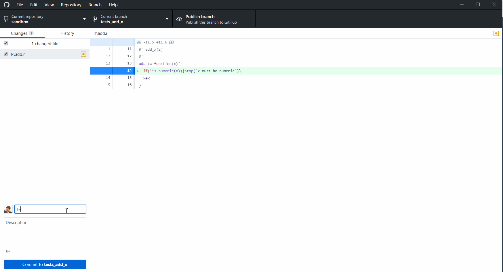

### Push

Whenever your work is done, or you go for lunch, you should push all your commits to github.com. To do so, just press the `Push origin` button in the center or in the upper window. Github desktop will send the changes to github.com, and they should appear in the repository.

If you just created your branch, you have to publish it Github.com before:

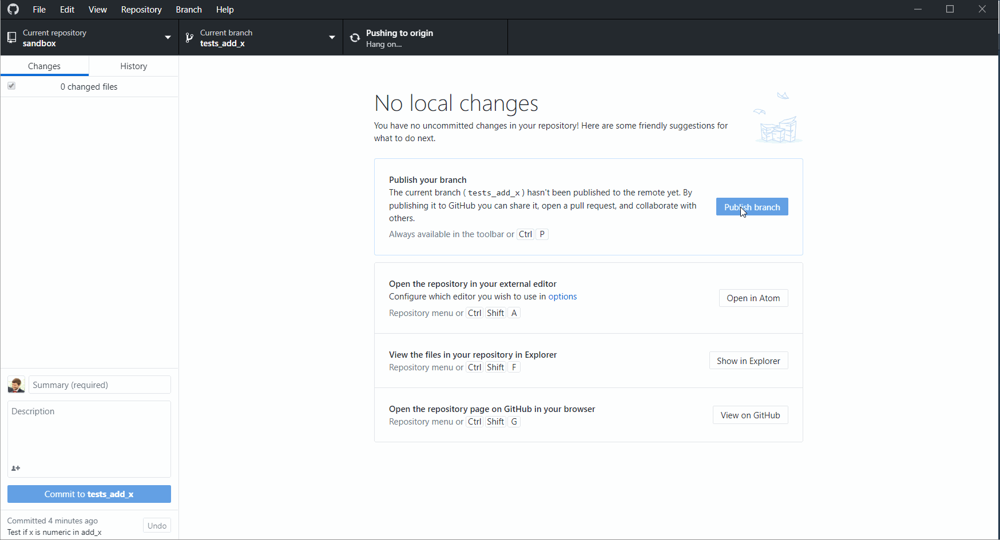

### Merge your changes

Now that everybody has made changes to the code, how do we integrate everything into the `master` branch ?  
Well, there are two ways:  
* Merge your branch into the `master` branch directly using `git merge`  
* Make a pull request using Github desktop  

If you merge your branch into the `master` branch, and then push it to Github.com, everybody will have your modifications, but nobody did check your modifications before. To avoid this, it is *mandatory* in the SticsRPacks projects to make pull requests.

### Pull request

Whenever you finished the modifications you wanted to do with your branch, you can make a pull request. This is a way of asking other contributors for their approval of the changes you made before merging your code to the `master` branch:

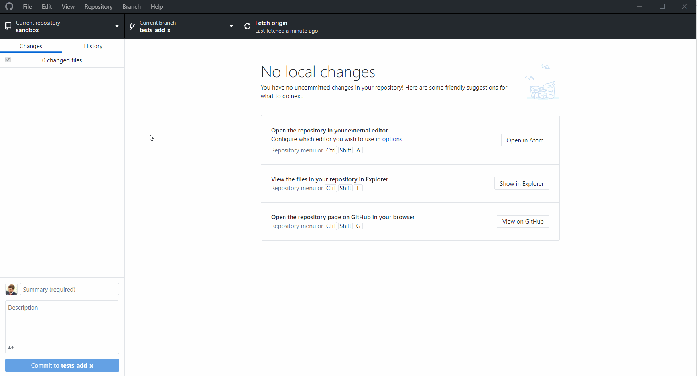

You'll have several steps to complete after:

* give a general title to your pull request, for example here it is named after the last commit: "Test if x is numeric in add_x"  
* add a little description of the changes
* check if the merge is automatic or not (is there any conflicts ?)
* wait for the automatic tests to run, and if they are successfull:
* assign a reviewer

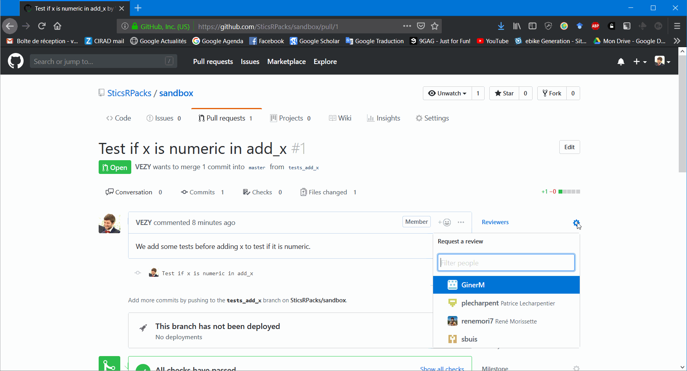

* and finally create the pull request.


### Review

Now that everybody has pushed his/her changes, the code has to be reviewed. As a reviewer, you'll have to open the pull request (in the Pull requests tab), and review the code in the "Files changed" sub-tab:

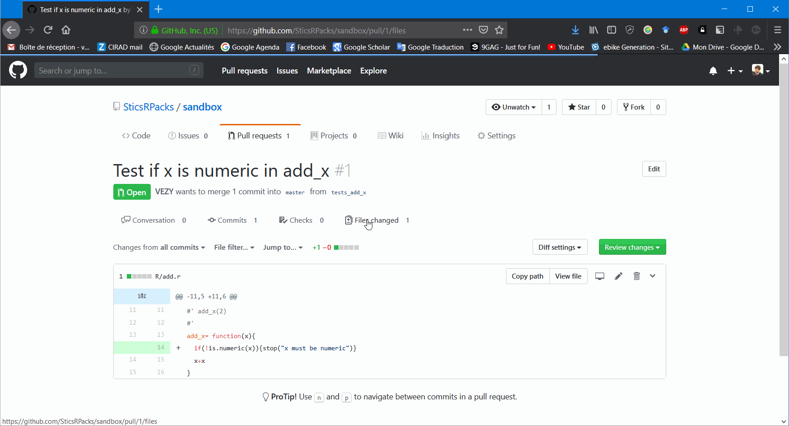

If there are some changes needed before merging the code to the `master` branch, you can leave a comment (and even propose some code) right where the changes are needed.

Then, the person that did pull the request will have to integrate those proposed changes into its own branch, commit the changes, and update the pull request.

Then, the reviewer will review the code again, and can finally accept the pull request:

When the pull request is accepted, it can finally be merged into the `master` branch:


This step will add all the commits from the branch to the `master` branch. A cleaner option is to use the `Squash and merge` option, which will combine all commits from the branch into one commit only. This option may be cleaner to avoid too many unnecessary commits in the master branch.  
It is recommended to delete the branch after merging it to make a cleaner repository.

Note that the previous step can be made all at once by the reviewer (accept and merge).

### Update

Once the merge is done, all users can update their local repository with the new code. If the branch was deleted from Github.com, it will still remain on the local copy of the user, so you will have to delete it manually using Github desktop:

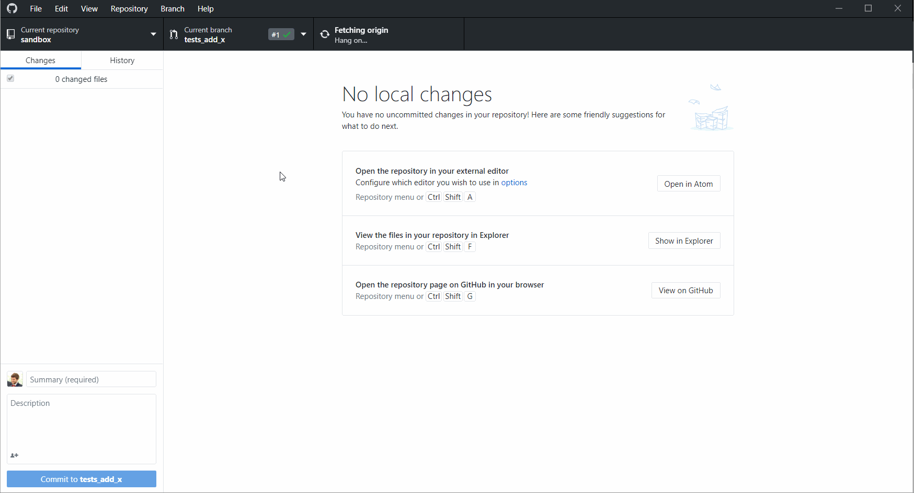


### Conflicts

A pull request may modify some code that was also modified by another user that pulled his changes before you in the `master` branch. In that case, GIT cannot know which code is the right one, or if there is a need of more code to integrate both changes, so a manual choice has to be made.

Here is an example of a conflict in two steps:

* Making different modifications on two different branches:


* Trying to merge the branches and resolving the conflicts using Atom:

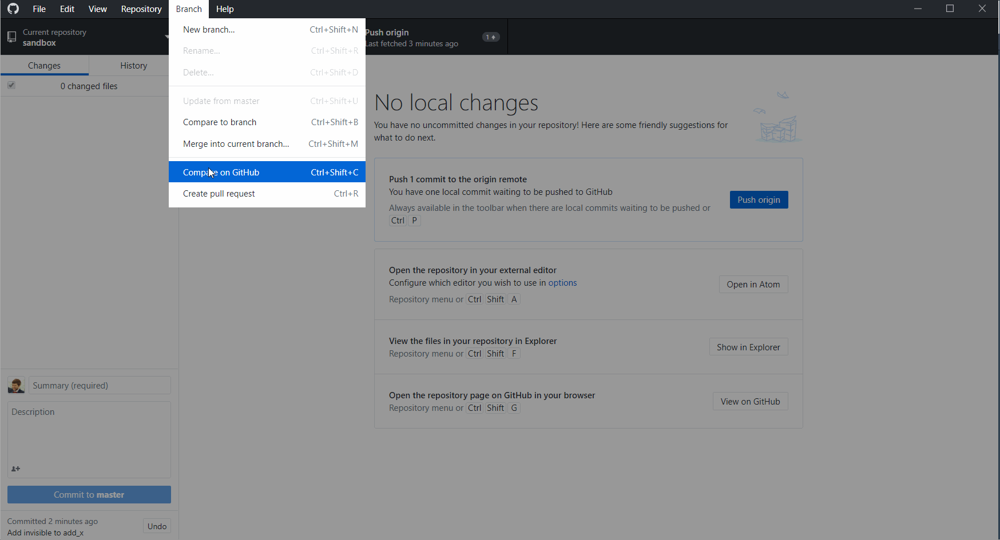


This is an example made on the local repository, but a pull request would yield the same result.

Here is an example with a pull request from a branch:

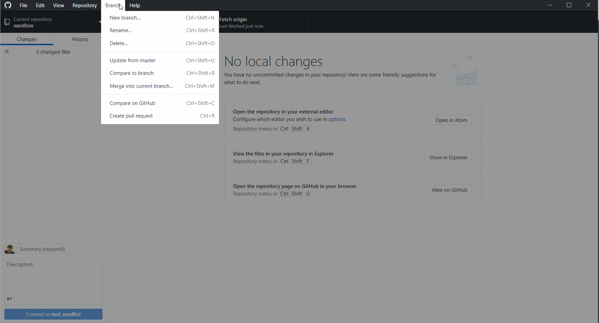

As you can see, this pull request cannot be automatically merged, so you have to resolve the conflicts from your computer, or you can even use the web editor if you prefer:

  


## Install from Github

New users can install the package directly from the Github repository using this command line:

```{r, eval=FALSE}
# install.packages("remotes")
remotes::install_github("SticsRPacks/sandbox")
# Or using devtools if already installed:
devtools::install_github("SticsRPacks/sandbox")
```

It will download the code from the master branch (or other if provided) and build the package from source (build tools needed).  

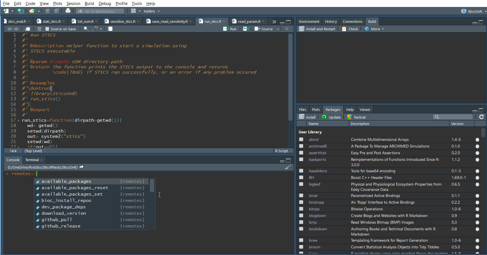

  
## Learn about continuous integration

Go to the next tutorial: [continuous integration](docs/articles/continuous-integration.html).  
Or go to the previous tutorial: [R package from scracth ](make-a-package.html).  
